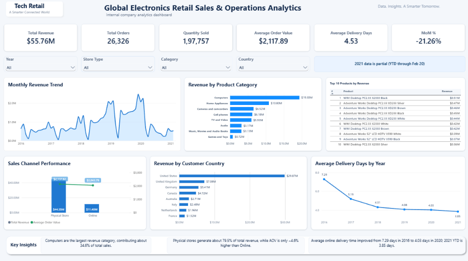

# Global Electronics Retail Sales & Operations Analytics

## Project Overview

This project analyzes sales and operational performance for a fictitious global electronics retailer using the **Maven Analytics Global Electronics Retailer dataset**.

The project is designed as an internal company analytics case study for a **Sales / Operations Manager**. The goal is to understand:

- overall sales performance
- revenue and order trends
- category and product performance
- online vs physical-store performance
- customer geography
- online delivery performance
- business changes that deserve further investigation

The focus is on practical, business-oriented analysis rather than unnecessary technical complexity.

---

## Business Questions

1. How is the business performing overall?
2. How have revenue and order volumes changed over time?
3. Which product categories and products generate the most revenue?
4. How do Online and Physical Store channels compare?
5. Which customer countries generate the most revenue?
6. How has online delivery performance changed over time?
7. Which business changes require further investigation?

---

## Dataset

**Source:** Maven Analytics — Global Electronics Retailer

Dataset page / download:
https://maven-datasets.s3.amazonaws.com/Global+Electronics+Retailer/Global+Electronics+Retailer.zip

Main tables used:

- `Sales`
- `Products`
- `Customers`
- `Stores`

Additional source table available:

- `Exchange_Rates`

The final Power BI model uses a simple star-schema-style structure with `Sales` as the fact table.

### Important Dataset Limitation

The sales data runs from **January 2016 through February 20, 2021**.

Therefore, **2021 is partial/YTD data** and should not be compared directly with complete prior years without using an equivalent date range.

---

## Data Preparation

Data preparation was performed in Power Query.

Key preparation steps included:

- validating data types
- keeping valid missing Delivery Date values for physical-store transactions
- storing postal codes as text
- converting product cost and price fields to numeric values
- creating a `Store Type` field:
  - Online
  - Physical Store
- creating `Delivery Days` for online orders

Valid business nulls were preserved instead of being filled or deleted unnecessarily.

---

## Data Model

Core relationships:

- `Customers[CustomerKey]` → `Sales[CustomerKey]`
- `Products[ProductKey]` → `Sales[ProductKey]`
- `Stores[StoreKey]` → `Sales[StoreKey]`
- `Date[Date]` → `Sales[Order Date]`

A dedicated Date table was created for monthly analysis and time-intelligence measures.

---

## Key DAX Measures

- Total Revenue
- Total Orders
- Quantity Sold
- Average Order Value
- Average Delivery Days
- Previous Month Revenue
- MoM %
- Latest Complete Month MoM %

---

## Dashboard



### Dashboard Sections

- KPI cards
- Monthly Revenue Trend
- Revenue by Product Category
- Top 10 Products by Revenue
- Sales Channel Performance
- Revenue by Customer Country
- Average Delivery Days by Year
- Interactive slicers for Year, Store Type, Category, and Country
- Key Insights summary

---

## Key Findings

### 1. Computers are the largest revenue category

Computers generated approximately **$19.30M**, contributing about **34.6% of total revenue**.

This shows that a large share of company revenue is concentrated in one product category.

### 2. Physical stores dominate revenue, but AOV is similar

Physical stores generated approximately **$44.35M**, compared with approximately **$11.40M** from Online sales.

Physical stores account for about **79.5% of total revenue**.

However, Average Order Value is relatively close between the two channels:

- Physical Store AOV: approximately **$2,137.82**
- Online AOV: approximately **$2,043.79**

This suggests the large revenue difference is more strongly associated with transaction/order volume than with a large difference in average basket size.

### 3. The United States is the largest customer market

Customers in the United States generated approximately **$29.87M** in revenue, making it the largest geographic contributor.

### 4. Online delivery performance improved substantially

Average online delivery time improved from approximately **7.29 days in 2016** to **4.03 days in 2020**.

The partial 2021 period shows approximately **3.85 days**, but it should be treated as YTD data.

### 5. Latest complete-month revenue declined

The dashboard's latest complete-month MoM measure shows approximately **-21.26%**.

This is a signal for further investigation by product category, country, store type, orders, quantity, and AOV rather than assuming a cause.

---

## SQL Analysis

The SQL file includes a focused set of business analyses:

1. Overall sales KPIs
2. Monthly revenue trend and MoM %
3. Category performance
4. Top 10 products by revenue
5. Category change analysis
6. Online vs Physical Store performance
7. Customer-country performance
8. Online delivery performance

File:

`sql/global_electronics_retail_analysis.sql`

---

## Tools Used

- Power BI
- Power Query
- DAX
- MySQL
- Excel / CSV
- GitHub

---

## Repository Structure

```text
Global_Electronics_Retail_Analytics/
│
├── README.md
├── dashboard/
│   └── global_electronics_retail_dashboard.png
├── sql/
│   └── global_electronics_retail_analysis.sql
└── powerbi/
    └── Add your .pbix file here
```

---

## Portfolio Value

This project demonstrates practical junior Data Analyst skills in:

- business problem framing
- data cleaning
- relational modeling
- KPI design
- SQL analysis
- DAX
- dashboard design
- trend analysis
- root-cause-oriented investigation
- communicating business insights

---

## Author

Portfolio project created as part of a Data Analyst learning and job-readiness portfolio.
